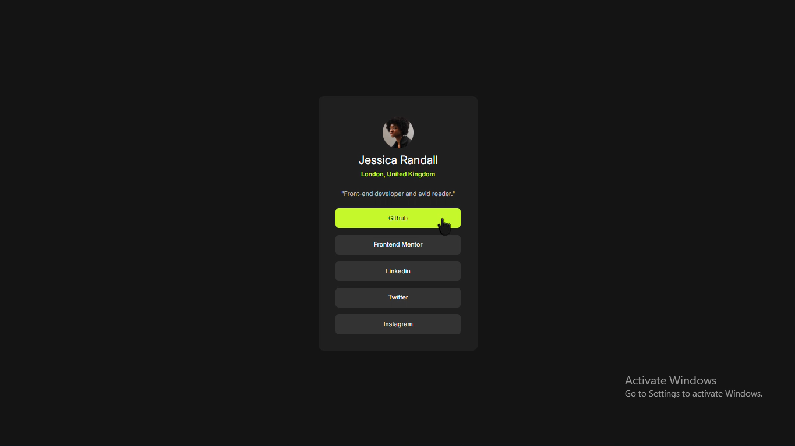
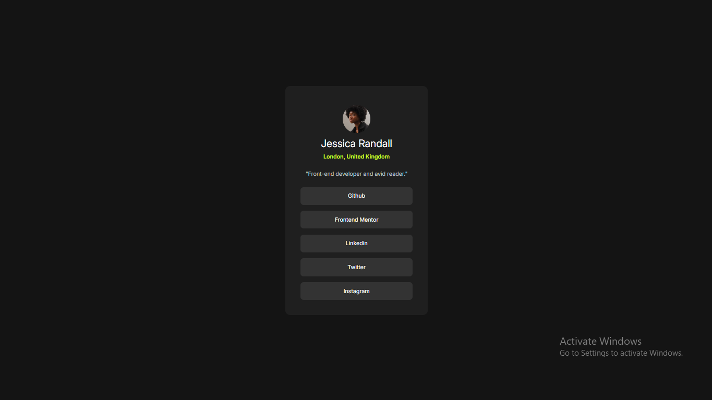
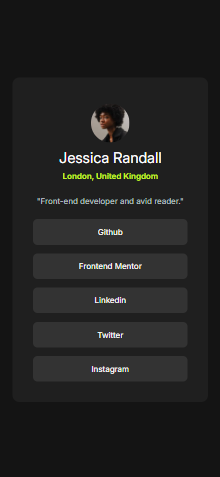

# Frontend Mentor Project 003 - Social links profile

This is a solution to the [Social links profile challenge on Frontend Mentor](https://www.frontendmentor.io/challenges/social-links-profile-UG32l9m6dQ). Frontend Mentor challenges help you improve your coding skills by building realistic projects.

## Table of contents

- [Overview](#overview)
  - [The challenge](#the-challenge)
  - [Screenshot](#screenshot)
  - [Links](#links)
- [My process](#my-process)
  - [Built with](#built-with)
  - [What I learned](#what-i-learned)
  - [Continued development](#continued-development)
- [Author](#author)

## Overview

### The challenge

Users should be able to:

- See hover and focus states for all interactive elements on the page

### Screenshot

### Links

- Solution URL: [Social links profile]()
- Live Site URL: [Social links profile Live]()

## My process

Step by step process for building the project by adding html and css for a particular block and then advancing to the next.

### Built with

- Semantic HTML5 markup
- CSS custom properties
- Flexbox
- Mobile-first workflow

### What I learned

I discovered the use of adjusting all the elements to create the project as close as the orginal one

### Continued development

I want to focus more on creating more complex designs and also designing things on my own time

## Author

- Website - Well I haven't made my profile portfolio, gonna make it sooon when I know a lot of stuffs
- Frontend Mentor - [@Shoaib-Bin-Rashid](https://www.frontendmentor.io/profile/Shoaib-Bin-Rashid)
- Twitter - [@ShoaibBinRashi1](https://x.com/ShoaibBinRashi1)
- Linkedin - [Shoaib Bin Rashid](https://www.linkedin.com/in/shoaib-bin-rashid)
